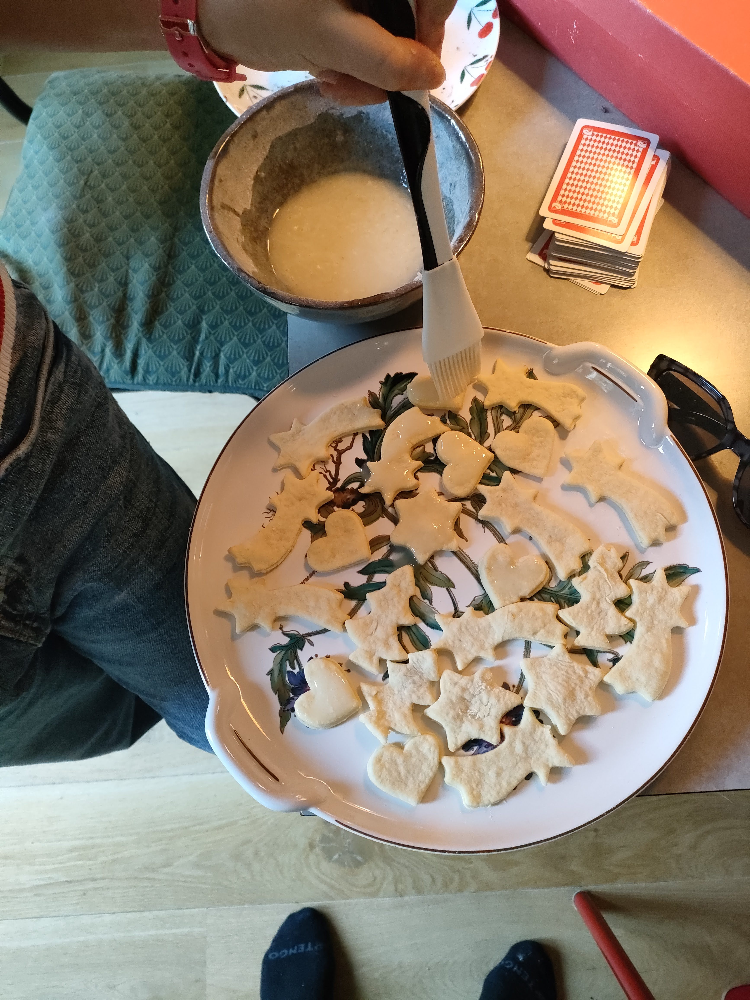

# :material-cookie: Citroenkoekjes 

<figure markdown="span">
  { width="300" }
  <figcaption>Ook zonder glazuur heerlijk!</figcaption>
</figure>

### :octicons-list-unordered-16: Ingrediënten 

* 1 bio citroen -> schil en sap 
* 50 gr poedersuiker
* 100gr boter
* 180 gr meel
* 1 Ei

Poedersuiker, boter, meel, ei, de schil van de citroen en 3 El citroensap kloppen totdat het een glad deeg is. 

160 graden ca 11 minuten bakken 

glazuur erop if you like 
