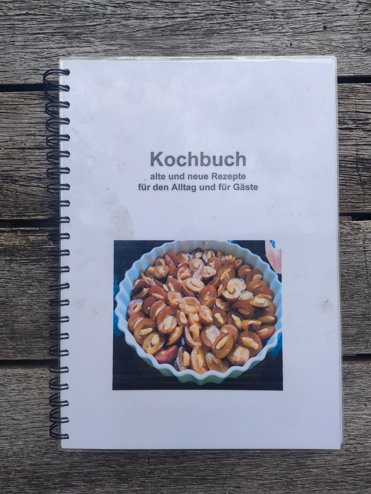
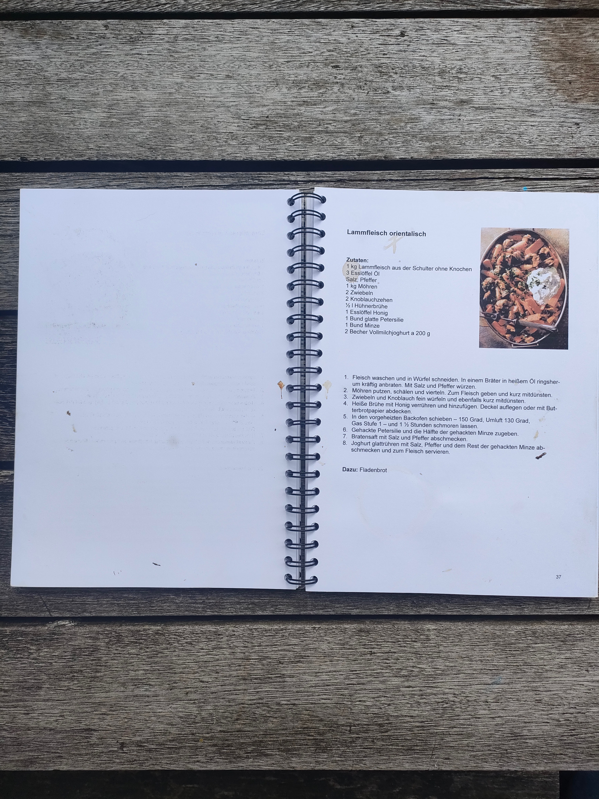

# Cooking

Recepten worden van generatie naar generatie doorgegeven. Ik heb een groot deel van de gerechten die we thuis altijd aten, leren koken met mijn ouders samen. Toen ik het huis uit ging, gaven ze mij een zelfgemaakt kookboek mee met zo'n beetje alle dingen die ze wisten te maken toen. 

<figure markdown="span">
  { width="300" }
  <figcaption>Het "Kochbuch" dat ik van mijn ouders kreeg.</figcaption>
</figure>
<figure markdown="span">
  { width="300" }
  <figcaption>Deze heb ik vaak gemaakt, voordat ik vegetariër werd.</figcaption>
</figure>

Onze kinderen zeiden ook al tegen ons, dat ze een kookboek wilden krijgen met onze familiegerechten. Hier is die dan, (nog) niet zo lekker ouderwets op papier, maar in ieder geval al in digitale vorm. 

{ width="300" height="100" }
{ width="300" height="100" }
{ width="300" height="100" }
{ width="300" height="100" }
<!-- { width="200" } -->

