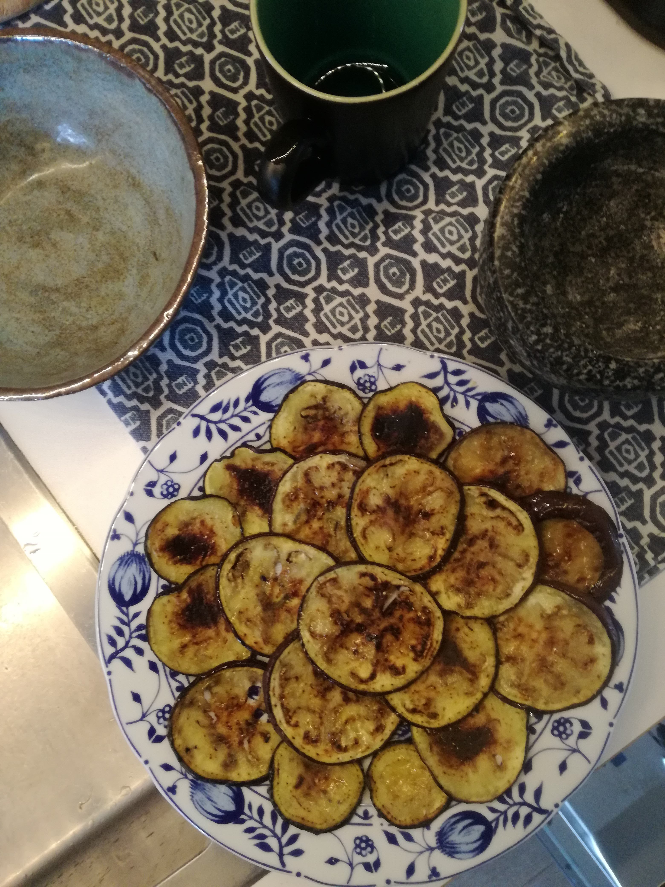
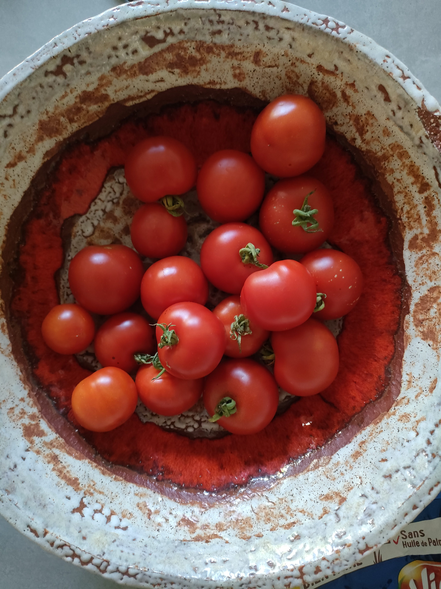
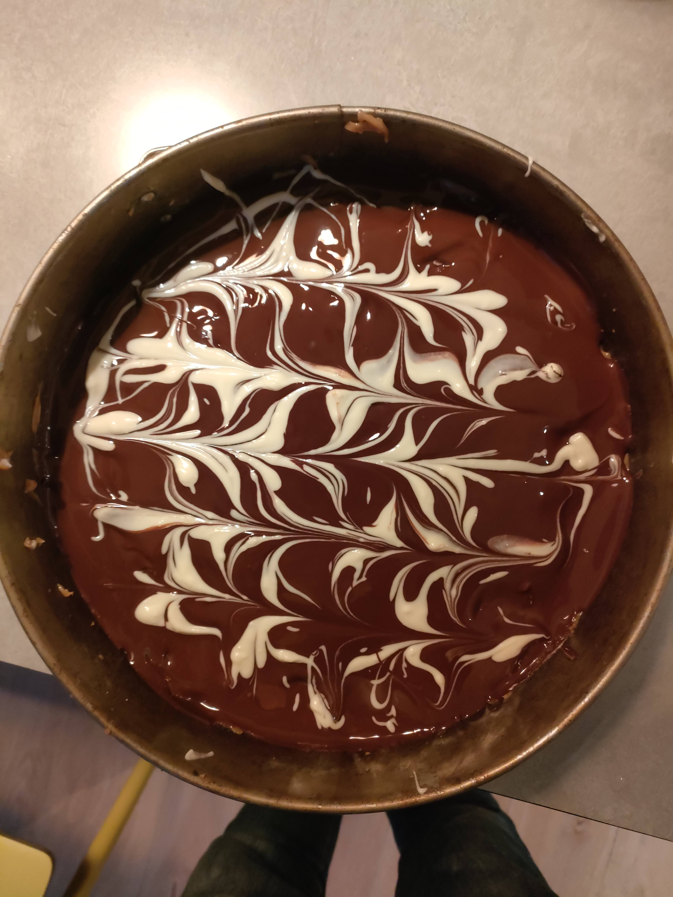
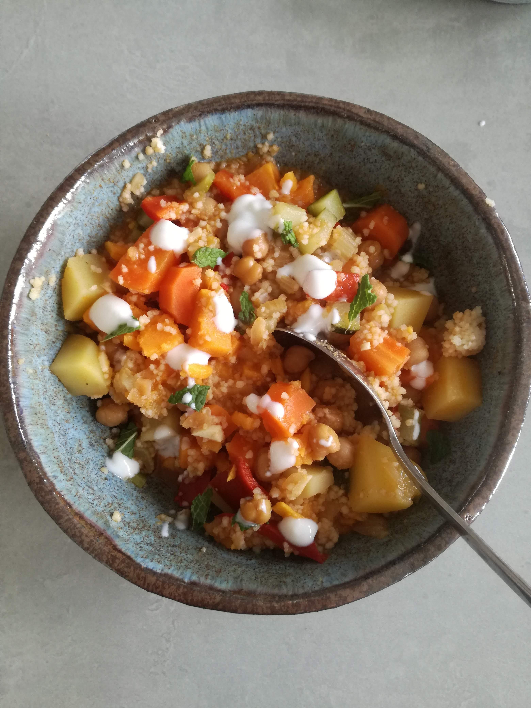

# Cooking

Recepten worden van generatie naar generatie doorgegeven. Ik heb een groot deel van de gerechten die we thuis altijd aten leren koken met mijn ouders samen en toen ik het huis uit ging gaven ze mij een zelfgemaakt kookboek mee met zo'n beetje alle dingen die ze wisten te maken toen. 

{ width="300" height="100" }
{ width="300" height="100" }
{ width="300" height="100" }
{ width="300" height="100" }
<!-- { width="200" } -->

Mijn kinderen zeiden ook al tegen mij dat ze een kookboek wilden krijgen met onze familiegerechten. Hier is die dan, niet zo lekker ouderwets helaas maar de digitale vorm werkt toch beter voor mij. 

