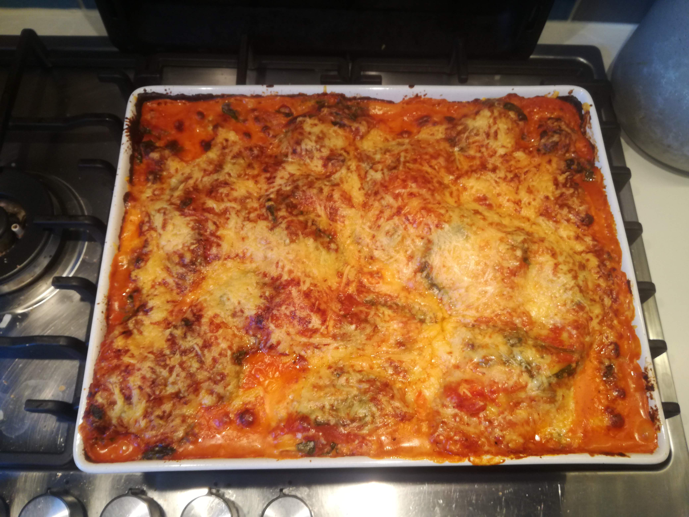
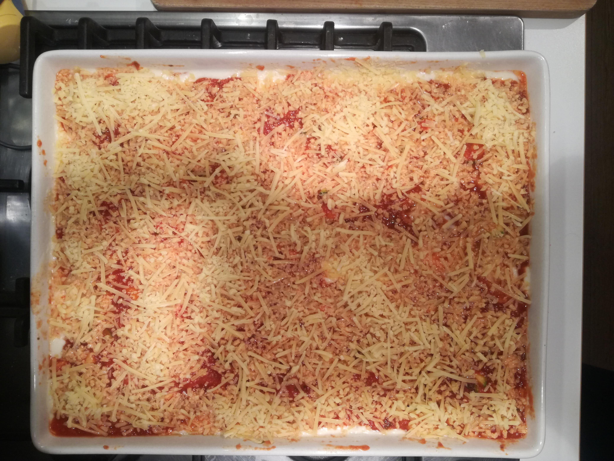

# :material-bowl-mix-outline: Vegetarische Lasagne

Als dit gerecht op tafel komt, wordt hier ook iedereen blij. Ook nog steeds een van mijn favoriete gerechten. Vaak de tweede dag zelfs nog lekkerder, dus ik maak altijd meer dan genoeg.

### :octicons-list-unordered-16: Ingrediënten 

=== "General"

    * 1/2 half pak lasagne bladeren 
    * 200 gram geraspte kaas

=== ":tomato: Tomatensaus"

    * olijfolie
    * 1 grote ui
    * 2 tenen knoflook
    * een paar rijpe tomaten (kan ook zonder)
    * 1-2 blikken gepelde tomaten
    * 1 fles passata 
    * 1 stengel bleekselderij
    * 1 wortel
    * 1 aubergine
    * 1/2 courgette
    * zout, peper, oregano, basilicum, tijm

=== ":material-soy-sauce: Bechamel sauce"

    * Parmezaanse kaas
    * melk
    * meel
    * olijfolie
    * muskaat
    * peper en zout
    * 75 gram oude kaas
    * 75 gram parmezaan 

Prik een paar gaten in de aubergine met een fork en leg hem in zijn geheel in de oven onder de gril. Draai om de 10 minuten een kwartslag totdat hij helemaal verschrompelt is (je wilt dat het vruchtvlees helemaal zacht is geworden en je de huid er makkelijk van af krijgt).

### :tomato: Tomatensaus

Bak de kleingesneden ui en knoflook aan in olijfolie (5 minuten). Voeg de kleingesneden wortel en bleekselderij toe. Af en toe roeren totdat de groente lekker zacht is geworden. Voeg de tomaten toe. Minimaal een uur laten pruttelen. Na 45 minuten voeg je de courgette toe. Haal de aubergine uit de oven, haal de huid ervan af, en hak het vlees in hele kleine stukjes en het bijna een soort brei is. Voek toe aan de saus. Breng op smaak met zout, peper en kruiden.    

### Bechamel sauce

Doe een flinke laag olijfolie in een kookpan (je kan ook half olijfolie, half zonnebloemolie doen), voeg meel toe en roer met een garde totdat je een redelijk vast mengsel hebt. Voeg een scheut melk toe en blijf roeren. Zodra het mengsel weer begint hard te worden, voeg je weer wat melk toe. En maar roeren! Dit blijf je doen totdat je een halve liter melk hebt verwerkt. Dan doe je de geraspte kaas erbij, muskaatnoot, een beetje zout en wat peper. 

### :material-layers-triple: Layering

Breng de oven op 180 graden. 

Pak een grote ovenschaal. De onderste laag is dun en van tomatensaus. Dan een laag lasagne bladeren, dan een laag bechamel. 

!!! danger "Kijk uit"
    Goed kijken hoeveel bechamel je hebt! Voor een laag of twee. Het is in ieder geval lekker om nog een klein beetje over te houden om de op de bovenste laag van tomatensaus heen te kunnen gieten. 

Je eindigt in ieder geval met een laag tomatensaus. Als het goed is heb je nog een beetje bechamel over, giet dan over de laatste laag heen. Geraspte kaas eroverheen, klaar.     

### :material-fire-circle: Al Forno!

Nu in de oven totdat de kaas lekker knapperig is (~30 min).
