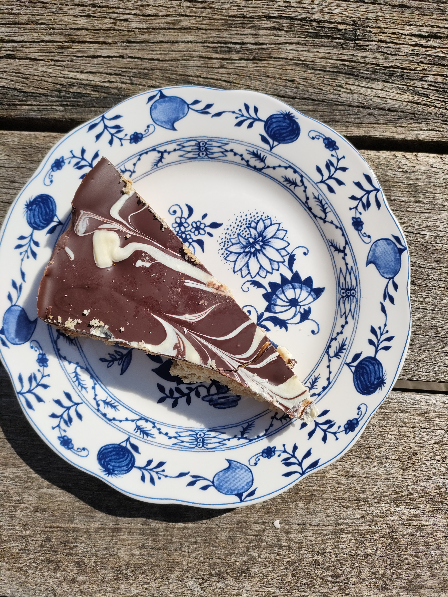
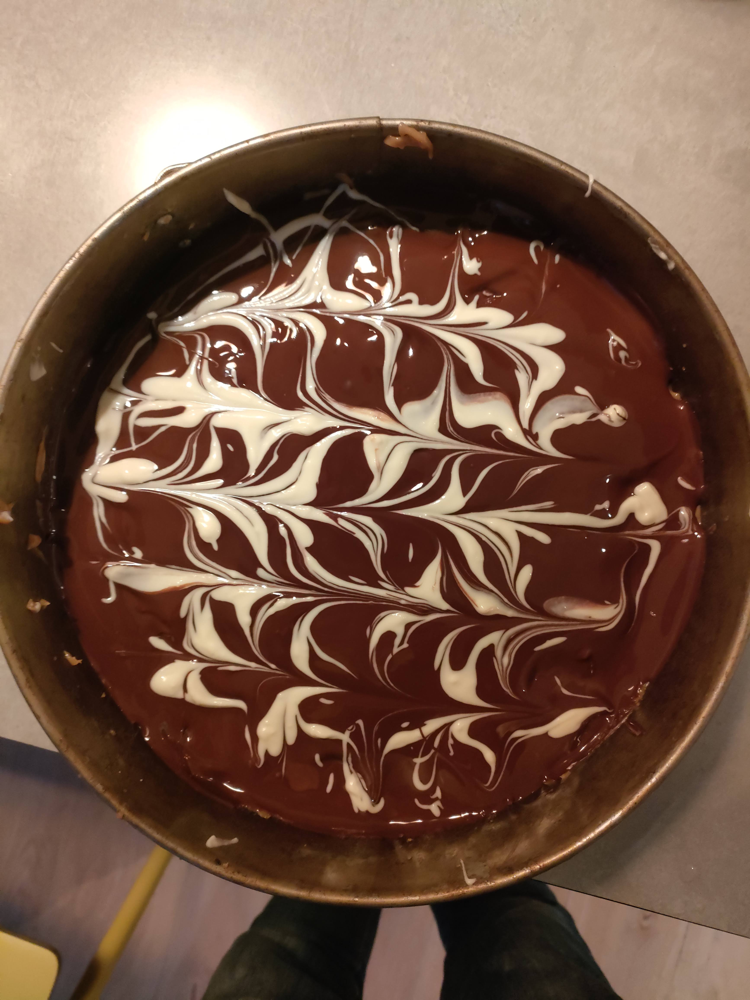

# :material-cake-variant: Caramel shortbread

Super lekker en super makkelijk. En ook nog eens mooi ;-)

{ width="350"}

=== ":material-adjust: Bodem"

    * 120 gr boter
    * 55 gr suiker
    * snuf zout
    * 150 gr meel

=== ":material-chart-pie: Caramel vulling"

    * 60 gr boter
    * 1 blikje condensmelk
    * 4 EL donkere basterdsuiker

=== ":material-chart-pie-outline: Topping"

    * 200 gr donkere chocolade
    * 40 gr witte chocolade

### Bodem 

Ingrediënten voor de bodem (behalve het meel) kloppen, dan het meel toevoegen. Doe in een ingevette springvorm en prik er gaatjes in. 20 min op 180 graden bakken.

### Caramel vulling

Boter in een pan smelten en dan de condensmelk en de suiker erbij doen. Even op laag vuur roeren totdat alles goed gemengd is. Breng daarna aan de kook en blijf 10 min roeren. Als het genoeg is ingedikt is de caramel klaar. Giet gelijk op de taartbodem en laat afkoelen. Zodra de caramel is afgekoeld kan de topping erop. 

### Topping
Smelt eerst de donkere chocolade en verdeel op de cake. Smelt dan de witte chocolade en giet hem in streepjes over de donkere chocola. Pak een tandenstoker een teken een mooi patroon door de twee kleuren chocola over elkaar heen te trekken. 

